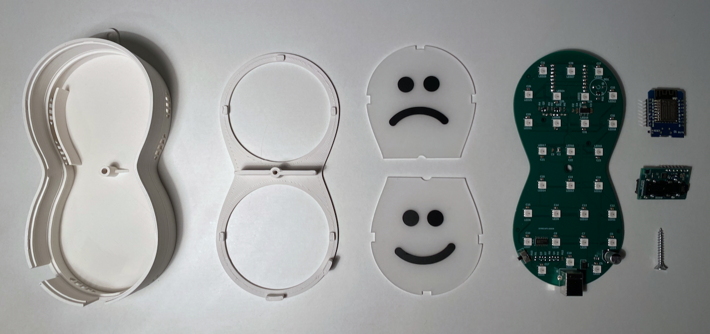
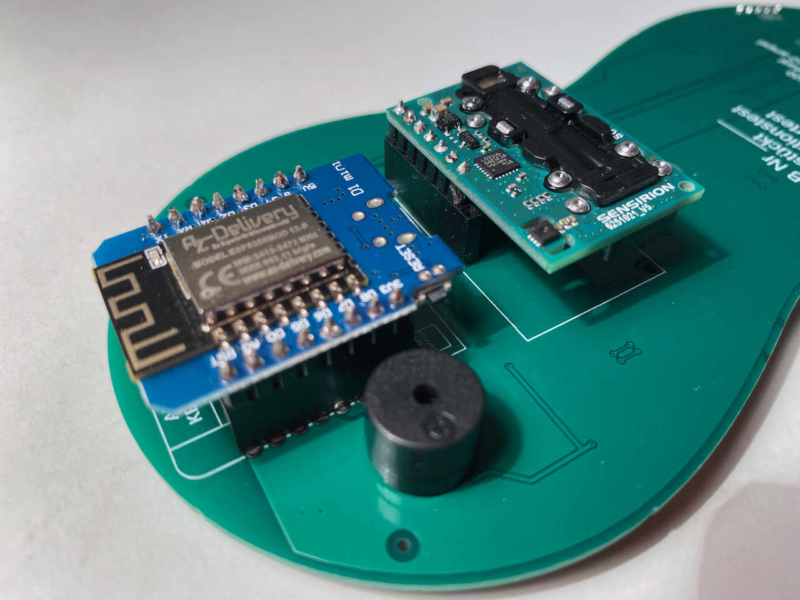
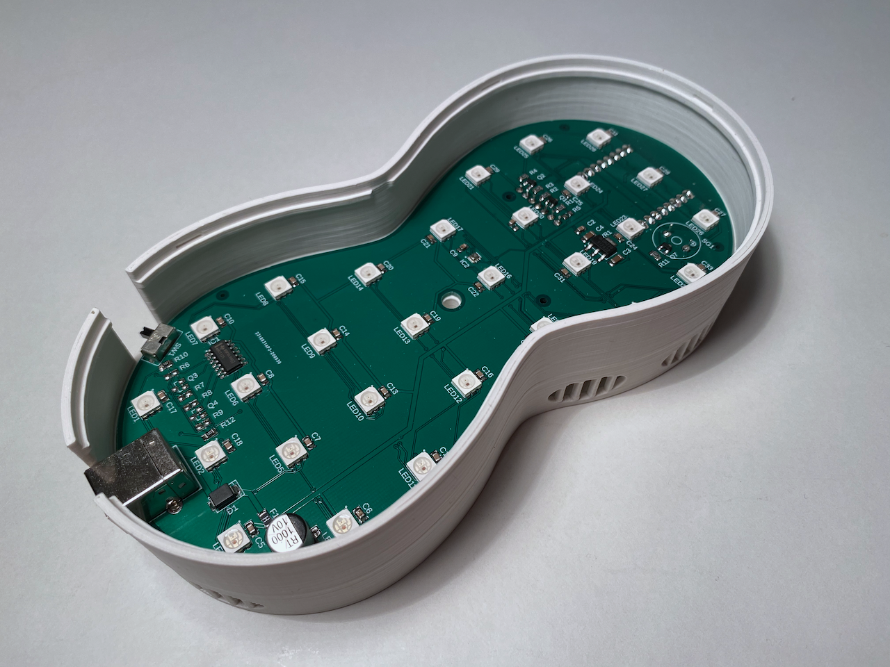
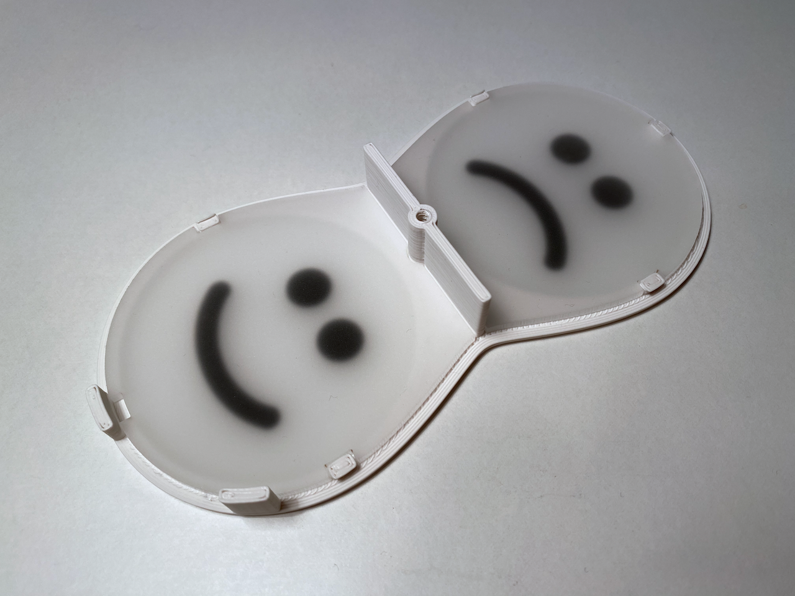
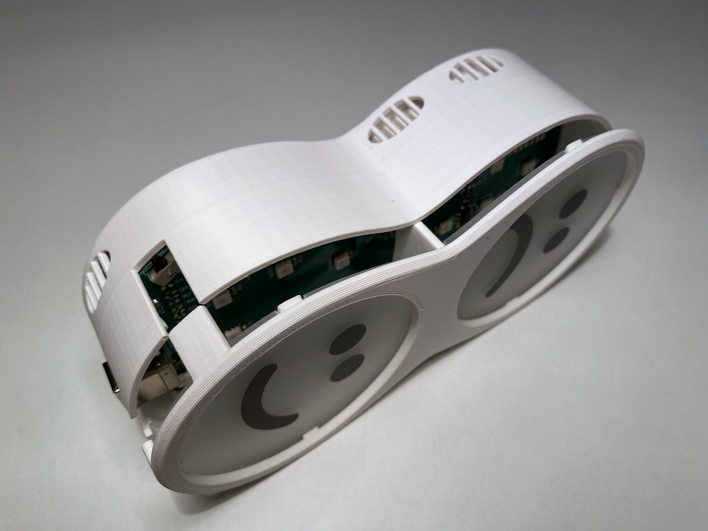
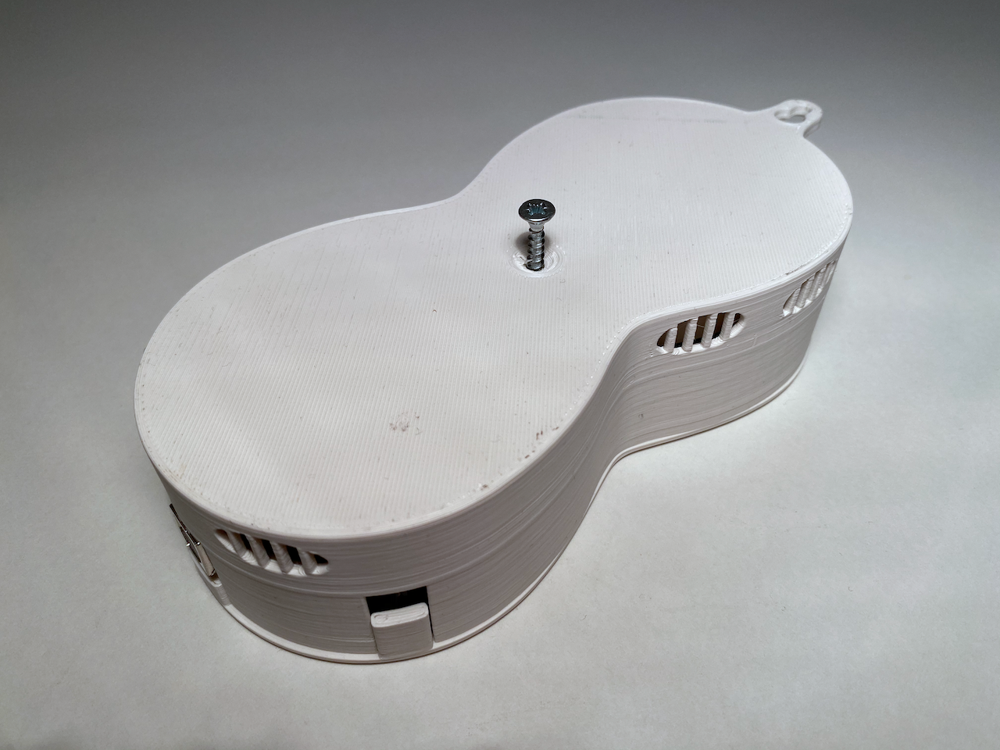
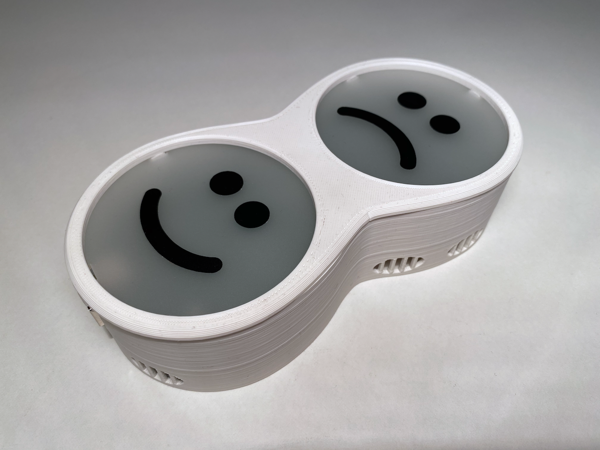

# Aufbauanleitung CO2 Ampel V2 (Bausatz)

Der Zusammenbau des Bausatzes der CO2-Ampel erfordert lediglich einige wenige Handgriffe, die in dieser Anleitung beschrieben sind.

## Kurzanleitung

Der Bausatz sich in wenigen Schritten zusammensetzen, die weiter unten im Detail beschrieben sind:

1. CO2-Sensor und Microcontroller (ESP) wie auf der Platine vorgezeichnet in diese einstecken ([Antistatikband](https://de.wikipedia.org/wiki/Antistatikband) verwenden!)
2. Platine so in das Gehäuse einlegen, dass Microcontroller und CO2-Sensor nach unten zeigen.
3. Die beiden Ampelscheiben in den Deckel des Gehäuses einsetzen: Trauriges Gesicht Richtung Aufhänger, fröhliches Gesicht Richtung USB-Buchse.
4. Den Deckel mit samt der Scheiben auf das Gehäuse stecken bis er einrastet.
5. Das Gehäuse an der Unterseite mit der beigefügten Schraube sichern.
6. Die Ampel wie in der [Bedienungsanleitung](Bedienungsanleitung.md) beschrieben in Betrieb nehmen.

## Übersicht der Komponenten

Bitte prüfen Sie vor dem Zusammenbau die Vollständigkeit der Einzelteile:

* Platine mit bereits eingelöteten Bauteilen und Buchsenleisten
* CO2-Sensor ([SCD30](https://www.digikey.de/product-detail/de/sensirion-ag/SCD30/1649-1098-ND/8445334)) mit eingelöteter Steckerleiste
* Microcontroller ([D1 Mini NodeMcu](https://www.az-delivery.de/products/d1-mini?variant=28983931346)) mit eingelöteten Steckerleisten
* Zwei Ampelscheiben mit aufgeklebten Gesichtern
* Unterteil des Gehäuses mit Typenschild
* Deckel des Gehäuses
* Schraube

## Einstecken der elektronischen Komponenten

ACHTUNG: Bitte handhaben Sie die elektronischen Komponenten vorsichtig und vermeiden Sie elektrostatische Aufladungen! Wir empfehlen die Verwendung eines [Antistatikbandes](https://de.wikipedia.org/wiki/Antistatikband). Falls keines zur Verfügung steht, erden Sie sich während der Montage durch Berühren der eines Wasserhahns, eines Heizkörpers oder des Erdungsbügels einer Steckdose. Vermeiden Sie außerdem das Berühren der Metallteile des CO2-Sensors!

Entnehmen Sie den Microcontroller aus dem Antistatik-Beutel und stecken Sie ihn mit der WLAN-Antenne nach außen wie auf der Platine vorgezeichnet in diese ein. Wiederholen Sie den Schritt nun mit dem CO2-Sensor und achten Sie dabei besonders auf elektrostatische Aufladungen.

## Einsetzen der Platine

ACHTUNG: Berühren Sie beim Einbau der Platine nicht die elektronischen Komponenten sondern fassen Sie die Platine nur am Rand oder an der USB-Buchse an.

Setzen Sie die Platine nun so in das Unterteil des Gehäuses ein, dass der Microcontroller und der CO2-Sensor sich auf der Unterseite befinden und die USB-Buchse sich in die dafür vorgesehene Aussparung des Gehäuses einfügt.

## Zusammenstecken und Verschrauben des Gehäuses

Das Gehäuse kann nun in wenigen Schritten zusammengesteckt werden:

### 1. Einsetzen der Scheiben

Zunächst werden die beiden Ampelscheiben so in den Deckel eingesetzt, dass die aufgeklebten Gesichter nach unten zeigen. Sie werden sich später also an der Außenseite des Geräts befinden. Auf dem Foto sind sie daher nur verschwommen zu erkennen. Das fröhliche Gesicht zeigt in Richtung der beiden hervorstehenden Zungen, die sich später am unteren Rand des Geräts befinden werden. Das traurige Gesicht wird sich am oberen Rand des Geräts befinden. Jede Scheibe verfügt über drei Aussparungen an denen Sie von am Deckel angebrachten Nasen gehalten wird.

### 2. Anbringen des Deckels

Nun werden Unterteil und Deckel gekippt, so dass weder die Platine noch die Scheiben herausfallen. Dann wird das Gehäuse zusammengedrückt, bis der Deckel in das Unterteil einrastet.

### 3. Verschrauben des Gehäuses

Schließlich werden Unterteil und Deckel von der Unterseite des Gehäuses mit der beigefügten Schraube gesichert. Dafür ist ein Kreuzschlitzschraubendreher erforderlich. Das Typenschild ist auf dem Foto nicht abgebildet.

## Inbetriebnahme

Die fertige CO2-Ampel V2 kann nun in Betrieb genommen werden. Folgen Sie dazu bitte der separaten [Bedienungsanleitung](Bedienungsanleitung.md).

