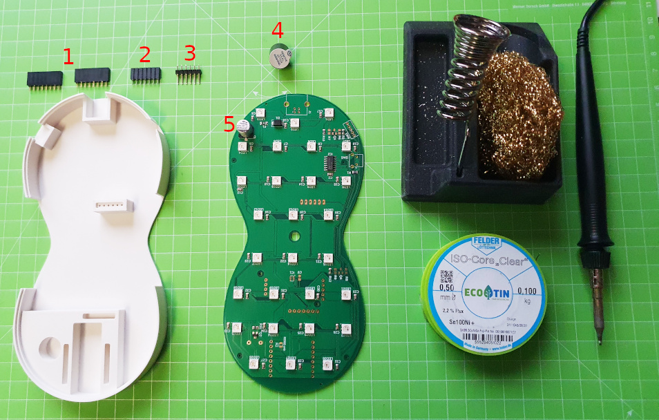
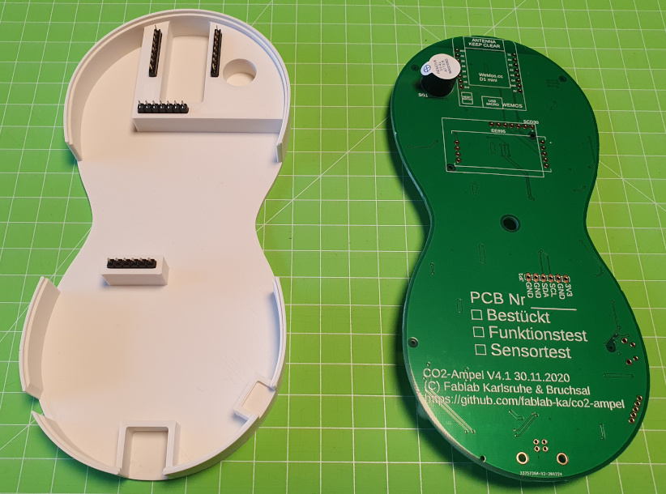
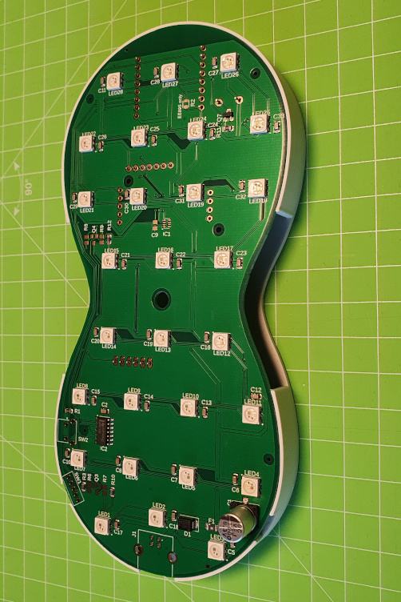
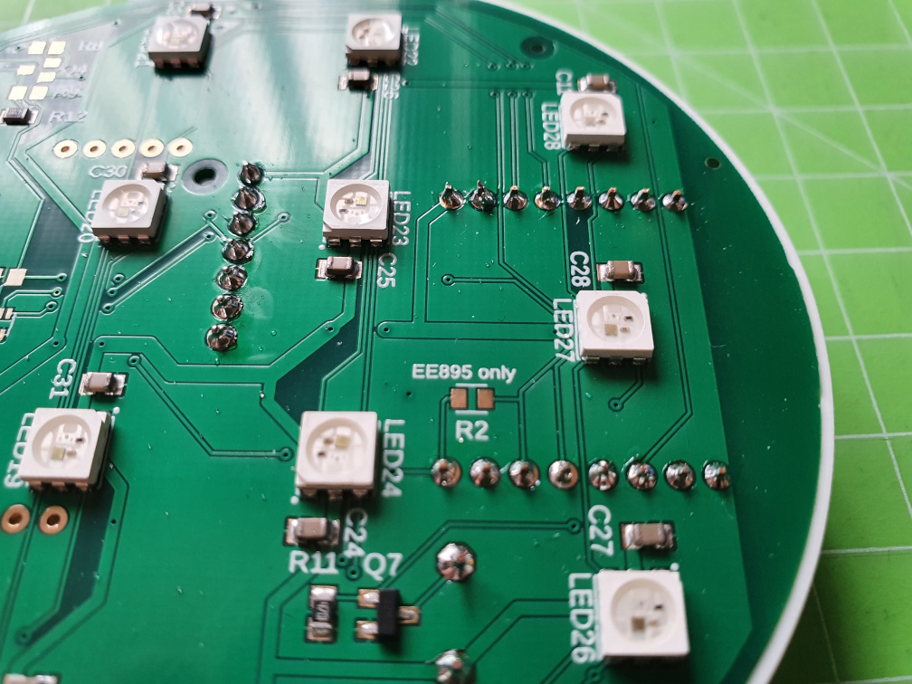

# CO2-Ampel Lötanleitung - PCB v4.1

## Teil I: Stiftleisten, Sockel und Buzzer

### Benötigte Bauteile
1. Buchse 8pin (2x): Diese findet ihr beim D1 Mikrocontroller
2. Buchse 7pin (1x)
3. Stiftleiste 6pin (1x): Diese findet ihr bei der bmp280 Platine
4. Buzzer (1x)
5. SMD bestückte Platine

### Benötigtes Werkzeug
* 3D-gedruckte Löthilfe für die Platine
* Lötstation (temperaturgeregelt)
* Lötrauchabsaugung
* Lötzinn (bleifrei 0.5-0.75mm Durchmesser)
* Seitenschneider
* Schutzbrille

### Arbeitsschritte
1. Kürzt mit einem Seitenschneider die langen Pins der **6Pin Stiftleiste**. Die Pins sollten auf beiden Seiten etwa gleich lang heraus stehen. Das vereinfacht eucht später das Löten. Wenn ihr keinen Seitenschneider habt, könnt ihr diesen Schritt aber auch überspringen. **VORSICHT VERLETZUNGSGEFAHR** Beim Schneiden können die abgeschnittenen Spitzen umher fliegen. Hier solltet ihr zur Sicherheit eine Schutzbrille aufziehen. 
2. Setzt die beiden 8pin Buchsen in die Löthilfe ein (a+b)
3. Setzt die 7pin Buchse in die Löthilfe ein (c)
4. Setzt die 6pin Stiftleiste in die Löthilfe ein (d). **WICHTIG:** Falls ihr in Schritt 1 die Beinchen nicht gekürzt habt, dann die kurzen Beinchen nach oben raus schauen lassen.
5. Buzzer (e) auf die Platine stecken (auf der Seite **ohne** LEDs). Falls der Buzzer beim Drehen der Platine abfällt, dann die Beinchen leicht zusammen drücken und dann nochmals einstecken. **WICHTIG:** Achtet hier auf die richtige Polarität. (+ auf dem Buzzer zu + auf der Platine).

6. Platine vorsichtig auf die Löthilfe stecken. Evtl. etwas rütteln, so dass die Stiftleisten in die Löcher der Platine rutschen. Wenn alles passt, dann die Platine fest in die Löthilfe drücken, so dass die Ränder bündig sind. 

7. Jetzt könnt ihr alle Pins anlöten. Achtet darauf, dass ihr den Lötkolben nur max 2-3 Sekunden an die Lötstelle haltet. 
8. **Qualitätskontrolle:** Das ist der wichtigste Schritt und erspart euch später viel Zeit bei der Fehlersuche. Prüft nochmals alle Lötstellen und schaut nochmal, ob ihr wirklich **kein Bauteil oder Pin vergessen** habt. Die **Lötstellen** sollten **glatt und leicht konisch** sein. Wenn sie rau sind, habt ihr vermutlich eine kalte Lötstelle. Dann solltet ihr das Lötzinn nach einer kurzen Abkühlphase nochmals erhitzen. 

Prüft am Schluss noch einmal, dass **keine Lötstellen miteinander verbunden** sind. Das kann später einen Kurzschluss verursachen und im schlimmsten Fall die Bauteile zerstören.

