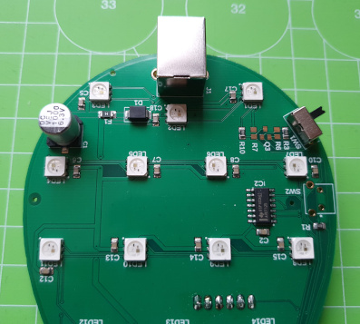
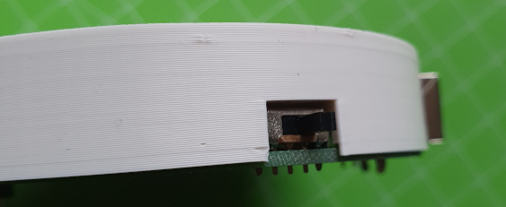
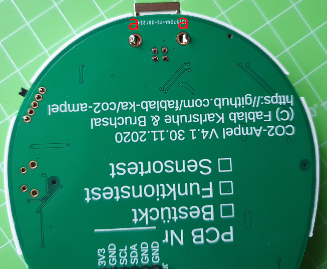
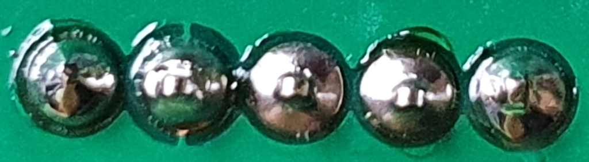

# CO2-Ampel Lötanleitung - PCB v4.1

## Teil II: USB-Buchse und Schalter

### Benötigte Bauteile
1. Platine aus Teil I
2. USB-Buchse
3. Schalter

### Benötigtes Werkzeug
* 3D-gedruckte Löthilfe für die Platine
* Lötstation (temperaturgeregelt)
* Lötrauchabsaugung
* Lötzinn (bleifrei 0.5-0.75mm Durchmesser)

### Arbeitsschritte
Auf der Platine sind die Positionen der Bauteile weiß markiert. Achtet bitte vor allem in diesem Teil darauf, dass ihr die Bauteile auf der richten Seite auf die Platine steckt.
1. USB-Buchse auf die Platine stecken (auf der Seite **mit** den LEDs)
2. Schalter auf die Platine stecken (auf der Seite **mit** den LEDs)

3. Platine in Löthilfe einlegen und wieder fest andrücken, so dass die Ränder bündig sind

4. USB-Buchse Befestigung (a) anlöten: Hier braucht ihr viel Lötzinn. Am schnellsten geht es, wenn ihr hier 1-2mm dickes Lötzinn verwendet. Falls ihr nur dünnes habt, dann am besten etwas Zinn auf der flachen Seite der Lötspitze sammeln und erst dann die Lötspitze an die Lötstelle halten. Hier ist es ok, wenn ihr die Lötspitze 4-5 Sekunden an die Lötstelle haltet. Bitte aber nicht länger, denn sonst erhitzt sich die Abschirmung zu stark und das Plastik schmilzt. Die Buchse nochmal auszulöten macht keinen Spaß.

5. Jetzt könnt ihr die restlichen Pins anlöten. Die 4 Pins der USB Buchse sitzen recht eng beeinander. Dreht euch am besten die Platine immer so, dass ihr bequem von außen die Lötspitze ansetzen könnt.
6. **Qualitätskontrolle:** Auch nach diesem Schritt bitte nochmal alle Lötstellen wie oben beschrieben prüfen. 

