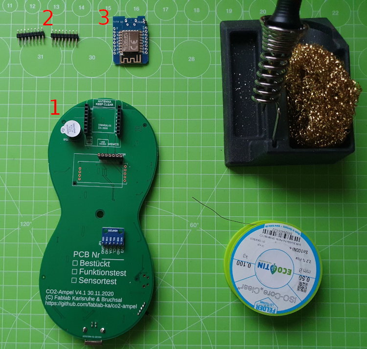
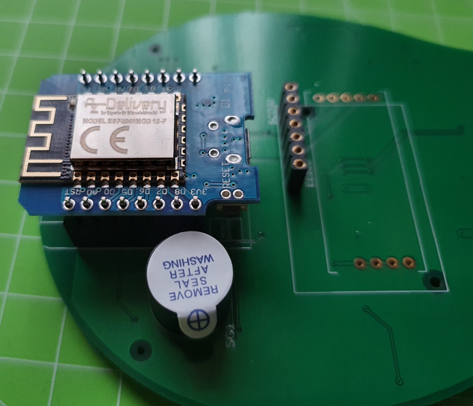
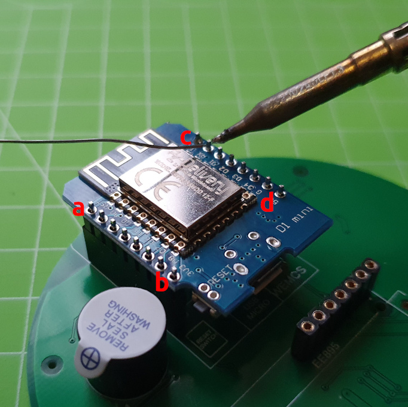

# CO2-Ampel Lötanleitung - PCB v4.1

## Teil IV: D1 Mikrocontroller

### Benötigte Bauteile
1. Platine aus Teil III
2. 8pin Stiftleisten (2x): Diese findet ihr beim D1 Mikrocontroller
3. D1 Mikrocontroller

### Benötigtes Werkzeug
* Lötstation (temperaturgeregelt)
* Lötrauchabsaugung
* Lötzinn (bleifrei 0.5-0.75mm Durchmesser)

### Arbeitsschritte
1. Steckt die beiden 8pin Stiftleisten in die Buchsen (a+b). **WICHTIG:** Die kurzen Enden schauen nach oben raus.

2. Legt den Mikrocontroller ein und achtet darauf, dass er richtig herum platziert ist. Die Antenne muss nach außen und die Mikro-USB Buchse des Controllers nach innen schauen. Auf der Platine ist dies auch in weiß eingezeichnet.

3. Drückt den Mikrocontroller auf die Stiftleiste und lötet zunächst die 4 äußeren Pins (a,b,c,d). Auch hier ist es wieder wichtig, dass ihr die Lötspitze von außen zum Mikrocontroller führt und das Lötzinn von Innen.

4. Jetzt könnt ihr ihn loslassen und die restlichen Pins anlöten. Auch hier wieder die Platine so drehen, dass ihr von außen die Lötspitze ansetzen könnt.
5. **Qualitätskontrolle:** Auch nach diesem Schritt bitte nochmal alle Lötstellen wie oben beschrieben prüfen. 

