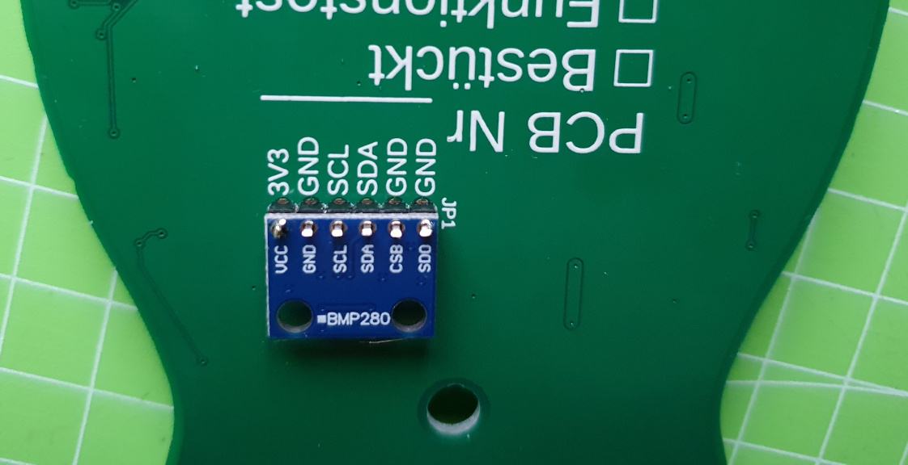
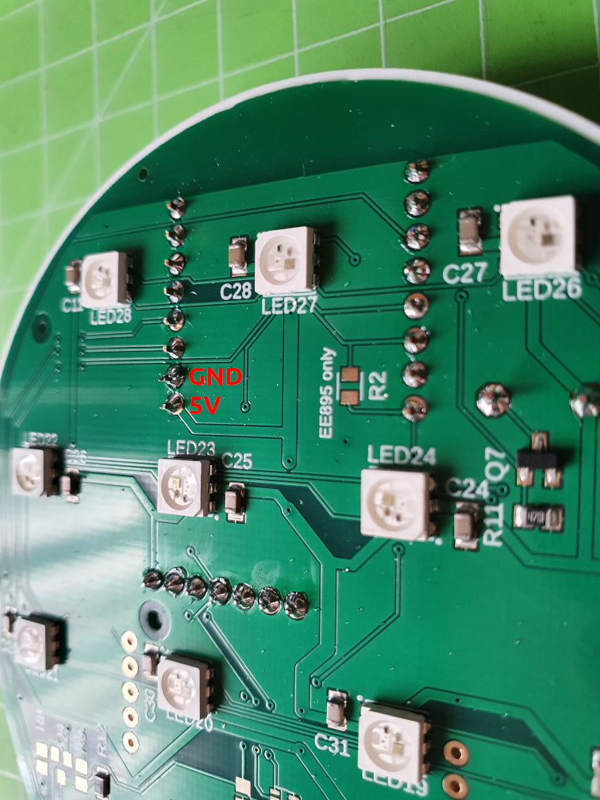

# CO2-Ampel Lötanleitung - PCB v4.1

## Teil V - Platine prüfen
### Benötigte Bauteile
1. Platine aus Schritt IV

### Benötigtes Werkzeug
* Multimeter

In diesem Teil messen wir mit einem Multimeter, ob es eine Kurzschluss zwischen plus und minus bzw. zwischen den Datenleitungen vorhanden ist. Die könnten beim ersten Einschalten dazu führen, dass die Bauteile oder die Platine beschädigt wird.

### Arbeitsschritte
1. Stellt eurer Multimeter entweder auf Durchgangsprüfer oder auf den niedrigsten Widerstandswert ein. Wenn ihr jetzt testweise die Messspitzen aneinander haltet, piept es entweder, oder es wird ein sehr kleiner Widerstand (ca. 0.1 Ohm) angezeigt.
2. An der BMP280 Platine sind fast alle zu messenden Leitungen vorhanden. Haltet die Messspitzen als erstes an VCC und GND. Wenn das Multimeter piepst oder einen kleinen Widerstand anzeigt, habt ihr einen Kurzschluss und müsst nochmals alle Lötstellen prüfen. Wiederholt die Messung mit folgenden Pins:
  * 3V3 + SCL
  * 3V3 + SDA
  * GND + SCL
  * GND + SDA
  * SCL + SDA

3. Als letztes messen wir noch den Widerstand zwischen 5V und Masse (GND). Das geht am besten an den beiden linken unteren PINs des Mikrocontrollers (siehe Bild) 

**Die Ampel darf erst an den Strom angeschlossen werden, wenn alle Kurzschlüsse beseitigt sind** 

