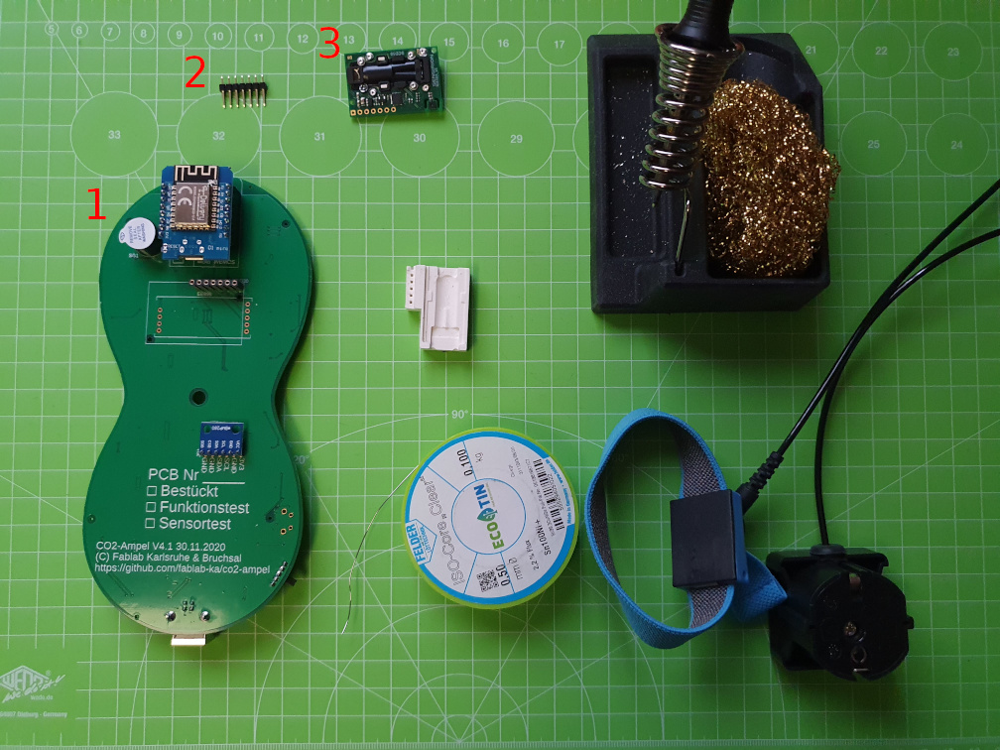
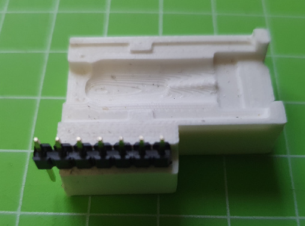
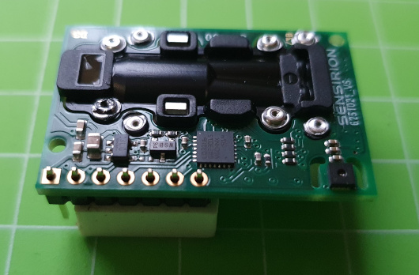
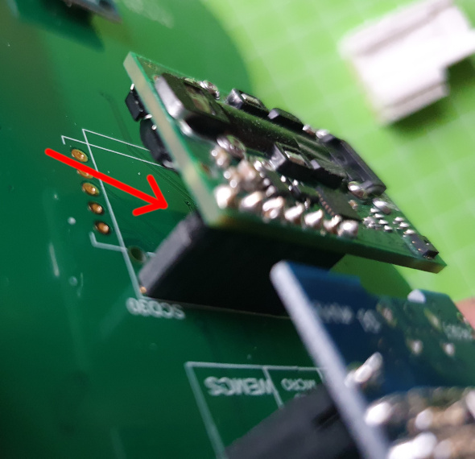

# CO2-Ampel Lötanleitung - PCB v4.1

## Teil VI - CO2-Sensor

### Benötigte Bauteile
1. geprüfte Platine aus Schritt V
2. Stiftleiste 7pin
3. scd30 CO2-Sensor

### Benötigtes Werkzeug
* 3D-gedruckte Löthilfe für den scd30
* Lötstation (temperaturgeregelt)
* Lötrauchabsaugung
* Lötzinn (bleifrei 0.5-0.75mm Durchmesser)
* Erdungsarmband

### Arbeitsschritte
Der Sensor ist das teuerste Bauteil und sehr empfindlich. Wenn ihr hier zu lange an einer Stelle lötet oder mit der heißen Lötspitze eines der SMD-Bauteile auf der Platine  berührt, könnt ihr ihn irreparabel beschädigen.

Der Sensor ist außerdem empfindlich gegen elektrostatische Aufladung. Ihr solltet daher bei diesem Schritt ein **Erdungsarmband tragen** und ihn nur am Rand anfassen.

1. Stiftleiste in die Löthilfe stecken (kurze Beine schauen raus)

2. Sensor einlegen (es gibt nur eine Position die passt). Vorsichtig andrücken.

3. Pins vorsichtig löten
4. **Qualitätskontrolle:** Auch nach diesem Schritt bitte nochmal alle Lötstellen wie oben beschrieben prüfen. 
5. Sensor auf die Platine stecken. Hier müsst ihr unbedingt darauf achten, dass der Sensor richtig sitzt und alle Pins in der Buchse stecken. **Wenn ihr ihn nur um einen Pin versetzt einsteckt, wird er beim Einschalten sofort zerstört.**

